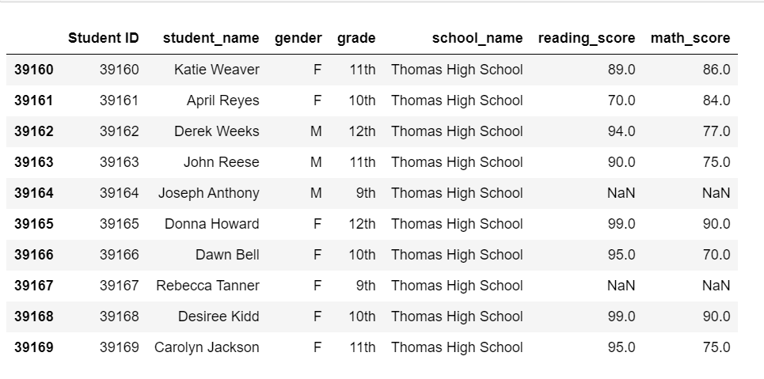
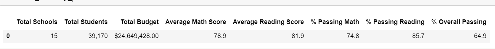
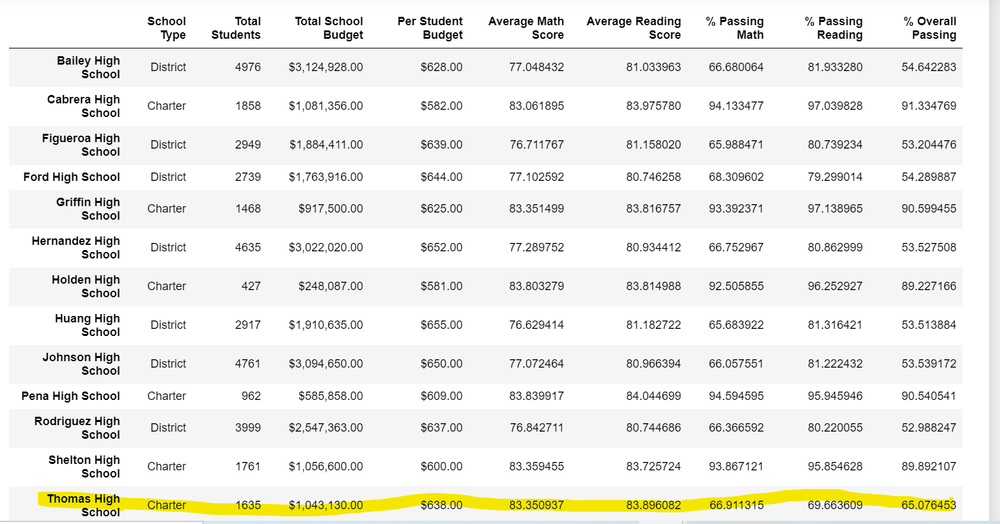
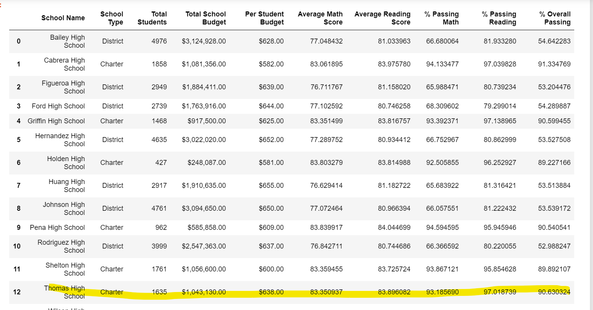

# School_District_Analysis

## Overview of the school district analysis

The school board is has some fear that there's an academic dishonesty for both math and readign scores for Thomas High School.

The work which is required is to replace the math and reading scores for Thomas High School with NaNs while keeping the rest of the data intact. 

Upon completion, we shall rerun the analysis of the school district and later write up a report to describe how these changes affected the overall analysis.

## Results
We have pulled out 4 graphs to portray our findings of the school district analysis as shown below.

* NaN DF for Ninth grade
    

The graph above highlights the change made for 9th grade for THS. Our inisght is that the change was insignificant to impact the overal district score. as it will be shown in the following graphs and the summary.

* District Summary DF
   

The district summary was not impacted significnatly by the changes. The overal passing for math is still below 75% and reading is the preferred subject with passign percentage of 85.7%.
It also shows the overall passing percentage at 64.9% while THS is at 65.0% which is not significant change, compared to all the district schools.

  * Formated  DF for THS
   

otwithstanding, the analysis demostrate that that all studens are inclined to be successfull in reading than math afte replacing the 9th graders. The scre for reading is way above the 80% compared to math below the 70%.

* New Metrics THS
   

The table shows that the passing percentage for reading is above 97% while math is at 93% confirmig our inital hypothesis. Furthemore, the average math score remains in the same percentile as average reading score of 83%. Both averages are respectively 83.35% and 83.89%.

### Summary
The analysis drawn didn't specificlaly brought in signifiant change after dropping the ninth graders. Nonetheless, points below are observed, in additional to the insights provided in the graphs above.

* Math and reading scores by grade confirmed that reading class is predominant and simple for students to succeed than math class, least preferred.
* Scores by school spending clearly shows that THS spent quite an amount per student in the same range as the top school and slightly below the maxmum of $675;
* Scores by school size placed THS in the medium size category with spending wwithin the $1,000-$2,000 bracket;
* Scores by school type demonstrate that charter schools are successfull in the overal passign for both math and reading and that District schools are strugglign to register a signficant number of studnets passing. The overal passing percentage is 87.1% and 53.6% respectively. Specifucaly, however, reading and math perecentga ear quite in the ame range for both schools types.

The attention should be drawn by the school board on the overal key elemens affecting the results. Doing this, will prompt for more data and more analysis for comprehensive findings.
